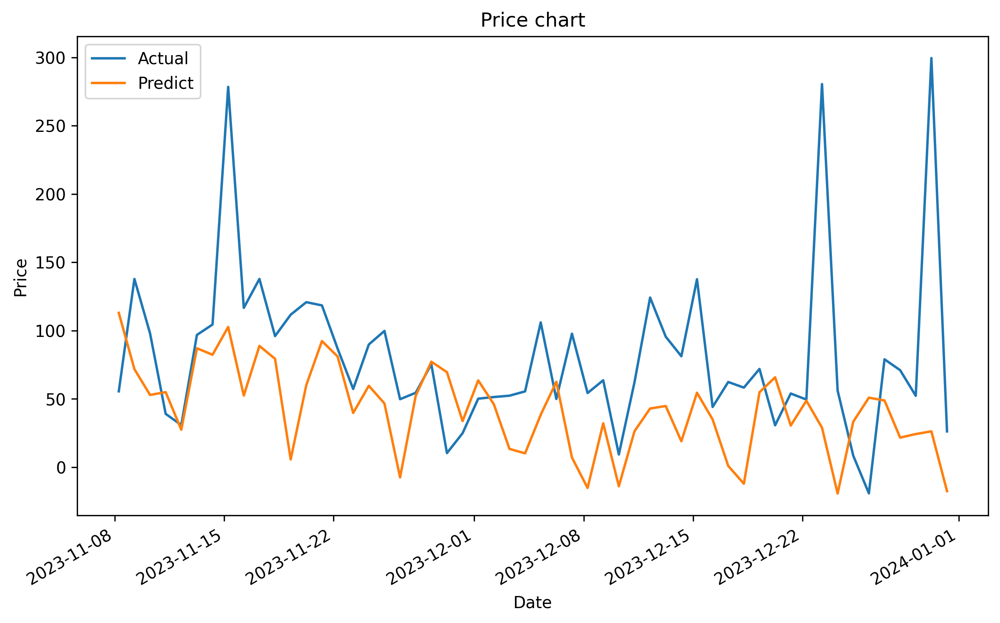

# prophet-time-series-forecasting
This repository hosts code for time series forecasting using the Prophet library.

How to use:
```bash
python3 src/main.py
```



### Data information

- `timestamp`: The time of the observation as a UTC+0 string (National Energy Market time is always UTC+10 so you may need to shift these 10 hours forward for the times to align with the australian day/night cycle). 
- `price`: the per megawatt spot price of electricity in South Australia for that interval in AUD (courtesy of [opennem](https://opennem.org.au)).
- `demand`: the total demand for electricity in South Australia for that interval in megawatts. **Note**: because of the high penetration of rooftop solar in south australia, the demand usually reaches a minimum at around midday UTC+10 (courtesy of [opennem](https://opennem.org.au)).
- `temp_air`: the air temperature in Adelaide at that time in degrees celsius (courtesy of [opennem](https://opennem.org.au)).
- `pv_power`: the total power in kilowatts generated by the solar panel attached to the battery at that time (courtesy of [solcast](https://solcast.com)).
- `pv_power_forecast_1h`: the total power in kilowatts that the solar panel is forecasted to generate in 1 hour from that time (courtesy of [solcast](https://solcast.com)).
- `pv_power_forecast_2h`: the total power in kilowatts that the solar panel is forecasted to generate in 2 hours from that time (courtesy of [solcast](https://solcast.com)).
- `pv_power_forecast_24h`: the total power in kilowatts that the solar panel is forecasted to generate in 24 hours from that time (courtesy of [solcast](https://solcast.com)).
- `pv_power_basic`: an estimate of the total solar power in kilowatts generated by the south australian energy grid at that time (courtesy of [solcast](https://solcast.com)).

**Note**: all solcast data is only provided for 1 year, so `training_data.csv` has `NaN` values for all solcast data for the first 2 years.